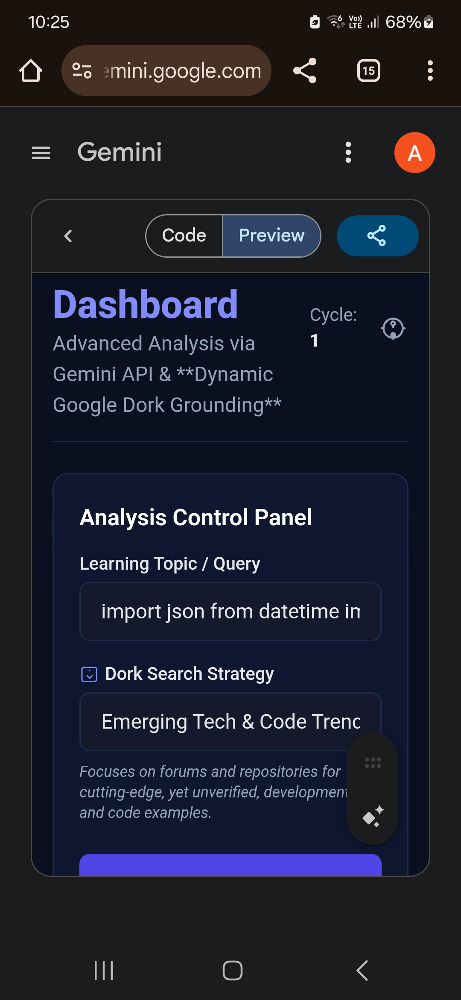

# SPED Cortex Dashboard

This dashboard is a React-based advanced analysis tool leveraging the Gemini API and "Google Dork" search techniques to enable deep, factual exploration of complex topics. It offers a simulated knowledge graph, multi-perspective persona analysis, and detailed system metrics in a modern, visually engaging UI.

## Features

- **API-Driven Analysis:** Integrates with Gemini API (Google) for real-time, high-quality document search and analysis.
- **Dynamic Google Dork Grounding:** Refines user queries using customizable search strategies for authoritative, cutting-edge, or structured sources.
- **Knowledge Graph:** Visualizes extracted facts and hypotheses as graph nodes, with relationships denoting confidence and flow.
- **Persona Report:** Runs results through three analytical personas: Critic (limitations), Optimist (potential), Synthesizer (summary).
- **System Metrics:** Tracks and displays accuracy, coherence, and novelty of insights for each learning cycle.
- **Character Set Analysis:** Dissects unique character usage from input/output streams for data profiling.
- **Cycle Log:** Keeps a rolling history of learning cycles and generated summaries.
- **Modern UI:** Fully responsive layout, with dark-mode aesthetics, semantic colors, and custom iconography.

## Setup

1. **Requirements**
   - React (with hooks)
   - Tailwind CSS (recommended for styling)
   - Access to Gemini API key

2. **Installation**

   Clone the repository and install dependencies:
   ```bash
   git clone https://github.com/craighckby-stack/Random.ai.html.git
   cd Random.ai.html/SPED
   # Install via npm or yarn, depending on your setup
   npm install
   ```

3. **Configuration**

   - On first use, a modal will prompt for your Gemini API key.
   - The key is stored locally in your browser.

4. **Running Locally**

   ```bash
   npm start
   ```

## Usage

1. **Enter a Topic:** Fill in your query or area of interest.
2. **Select Dork Strategy:** Choose how results are sourced:
   - Academic/Official Reports
   - Emerging Tech & Code Trends
   - Financial & Corporate Data
3. **Analyze:** Start a learning cycle and view:
   - Advanced search queries used
   - Knowledge graph updates
   - Detailed persona-based analysis
   - System metrics and logs

Refer to the included screenshots (`Screenshot_*.jpg`) for UI previews.

## File Structure

- `SPED Cortex Dashboard`: Main React component (entry point)
- `Screenshot_*.jpg`: UI snapshots for documentation

## Example



## License

MIT

---

Built as part of the [Random.ai.html](https://github.com/craighckby-stack/Random.ai.html) project.
